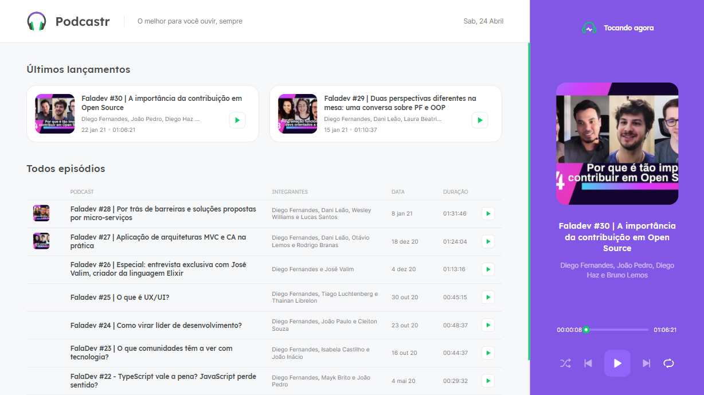
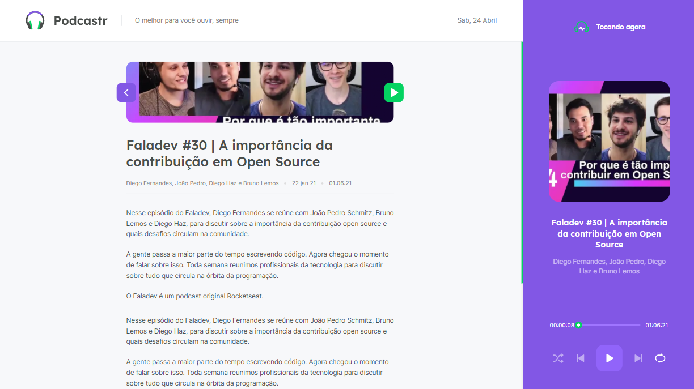

# Podcastr - Next Level Week #5

Podcastr is an application developed during Next Level Week #5, a one week course focused on React.js.
It is a podcast player, much like a podcast would have for their own website. It features listing, routing, player features (play/pause, next/previous, shuffle, replay and slider) and it is using Next.js to provide Static Site Generation, allowing these podcasts to be indexed by search engines.

### :cd: Technologies and Features

- Next.js
- React.js
- Typescript
- Static Site Generation
- Json-Server plugin
- Sass
- Functional components
- Context API
- Hooks

### :sunglasses: Reasoning behind features

- This app is using Next.js since it is a public application. A podcast website wants to be indexed by search engines so it can be found by listeners. Regular React would not work, since crawlers would not find any content to be indexed. Nextjs creates static pages that can be indexed by crawlers. 

- Json Server is a package that provides a frontend application with a mock database. Since this was a practice application for Next.js, Json server is a quick way to simulate a backend.

- Typescript is an amazing tool to increase code maintenability. Other developers working on the code in the future will have perfect documentation about each available property and method, withou having to do any search by hand.

### :exclamation: TODO

- Add responsiveness. The app is currently web only, and not responsive for mobile screens.
- Make it a Progressive Web App. Users might want to use Podcastr as an offline application or "install" it on their devices.

### :computer: Instructions to run

- Clone the repo.
- Run `yarn` or `npm install` to install dependencies.
- Run `yarn server` to start a JSON server that will provide the app with a mock backend.
- Run `yarn build` or `npm run build` to build a production build and get the benefits of SSG.
- Run `yarn start` or `npm run start` to start the application on port `:3000`.

### :camera: Preview

